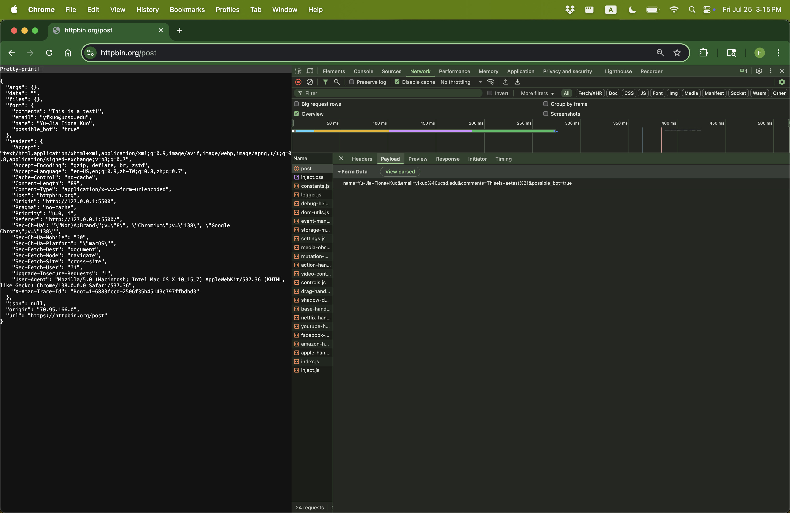
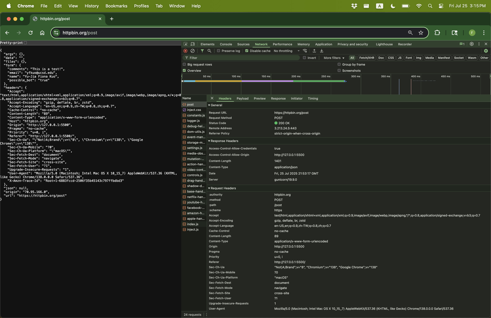
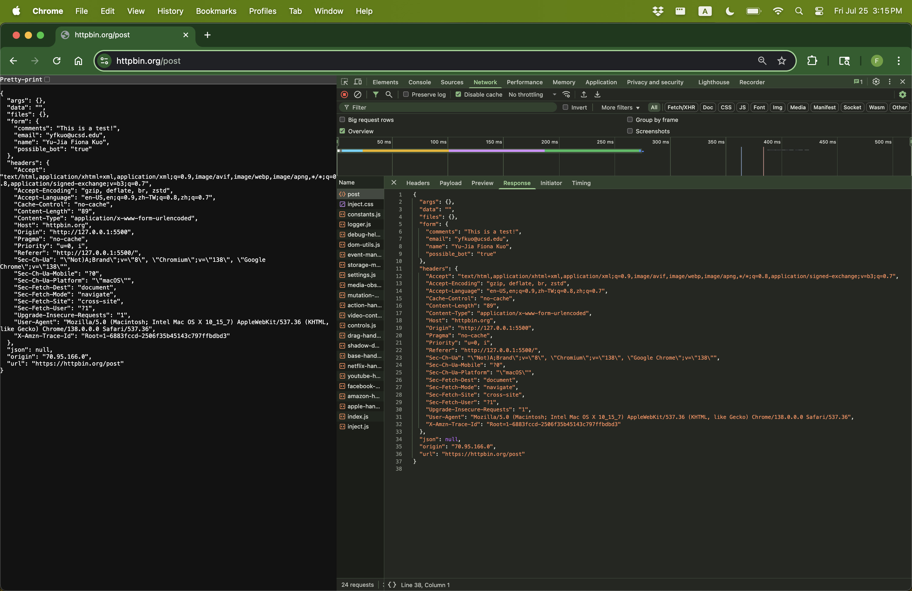
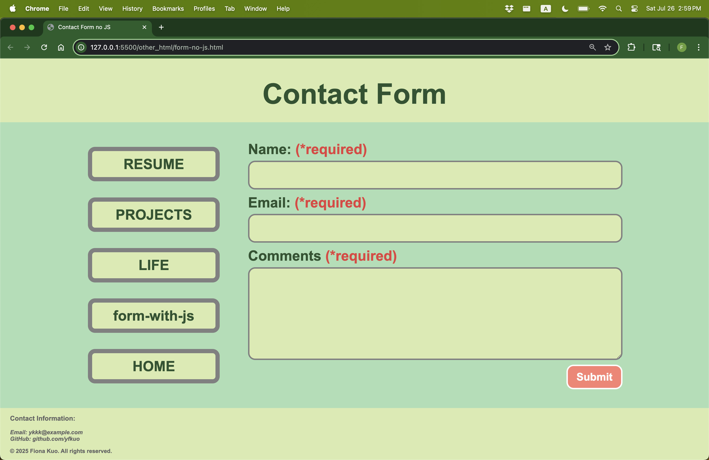
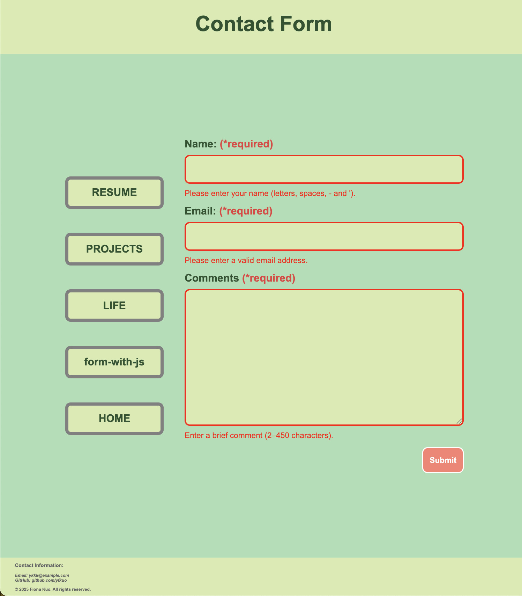
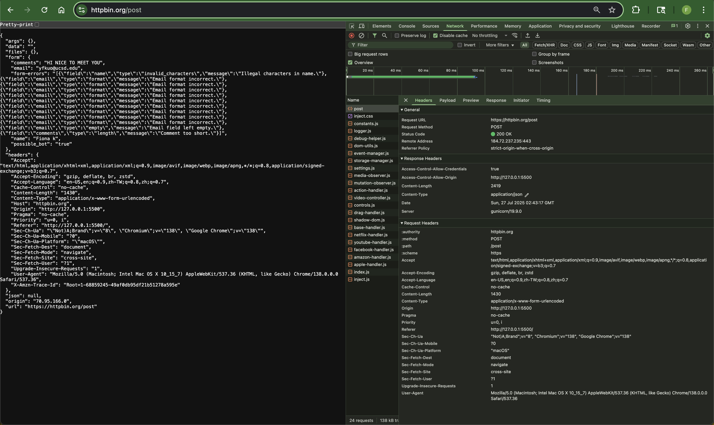
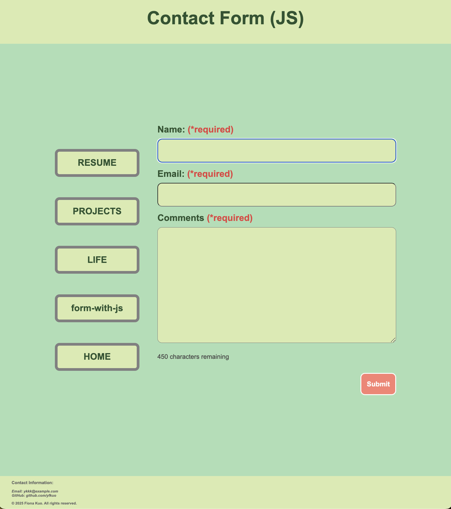
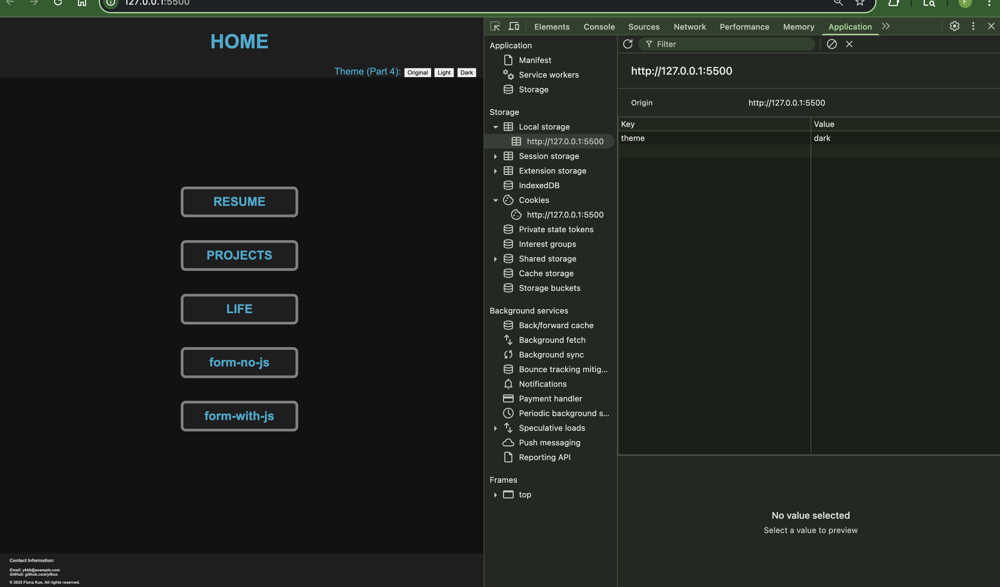

# cse134b_hw4

- Netify: [link](https://cse134bhw-4.netlify.app/)

## Part 1:
### a:
POST /post HTTP/2 
Host: httpbin.org 
User-Agent: Mozilla/5.0 (Macintosh; Intel Mac OS X 10_15_7) AppleWebKit/537.36 (KHTML, like Gecko) Chrome/138.0.0.0 Safari/537.36  
Content-Type: application/x-www-form-urlencoded  
Content-Length: 89  
Date: Fri, 25 Jul 2025 21:53:17 GMT  

name=Yu-Jia+Fiona+Kuo&email=yfkuo%40ucsd.edu&comments=This+is+a+test%21&possible_bot=true 

### b: 

### c: 

## Part 2:
### d:  check other_html/form-no-js.htm

## Part 3:
### e: 

### f: check other_html/form-with-js.htm

## Part 4:
### g: 

## Part 5
### h: 
- [Weekly Checklist Template on Astro](https://weeklychecklisttemplate.netlify.app/checklist)
- [Source Code 1](https://github.com/yfkuo/astro-checklist/blob/main/src/components/WeeklyChecklist.astro)
- [Source Code 2](https://github.com/yfkuo/astro-checklist/blob/main/src/pages/checklist.astro)
